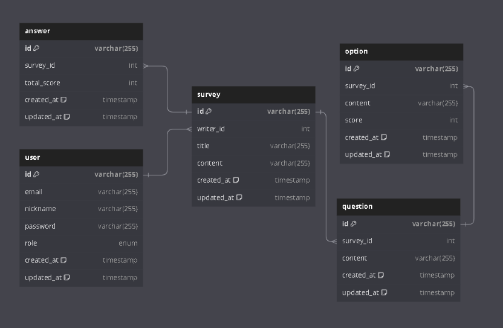

<h1 align="center">Welcome to Nest.js Survey Server 📋</h1>
<p>
  
  <a href="https://github.com/kefranabg/readme-md-generator/graphs/commit-activity" target="_blank">
    
  </a>
  <a href="https://github.com/JasonSong97/Joshua_Board/blob/main/LICENSE" target="_blank">
    
  </a>
</p>

> Nest.js Survey Back-End Server

<p align="center">

</p>
<h2 align=center>Nest.js를 이용한 설문지 프로그램📋, Survey </h2>

## 실행방법

1. survey와 같은 경로에서 터미널을 열어 docker를 실행합니다.

```
docker-compose up
```
2. docker-compose.yaml에 있는 파일을 참고해서 기존 더미데이터가 postgresql에 기록됩니다.

3. docker의 포트와 nest.js를 연결 시키기 위해서 nest.js를 실행합니다.

```
yarn start:dev
```
- 만약, nest.js 실행 시, port 에러가 발생한 경우 다음의 과정을 따라주세요.
  - a. cmd창을 관리자 권한으로 열고 `netstat -ano`를 입력해주세요.
  - b. 만약 5432 port가 2개가 떠있을 경우, 지금 실행하는 docker를 `docker-compose down`으로 중지하고 2개중 남아있는 5432 port를 `taskkill /f /pid {PID}`를 입력해주세요.
  - c. 다시 `docker-compose up`을 실행해주고, `yarn start:dev`를 실행해주세요.
  - 다음과 같은 에러가 발생한 이유는 이전의 도커가 존재해서 Nest.js에서 연결의 오류가 발생했기 때문입니다.

4. docker에서의 postgres와 nest.js와 연결이 되고 postman에서 테스트를 진행합니다.

- postman 실행시 **http:localhost:4000**으로 해야합니다.
- 반드시 login을 진행해서 Guard가 있는 api접근시, accessToken을 들고가야합니다.

## REST api

- [REST api 정리](https://docs.google.com/spreadsheets/d/1hfT20_CdOi3RzdijfroLHEFmcJcp38z3JLAct1ChwSM/edit?usp=sharing)

## Swagger

- [API Swagger](http://localhost:4000/api)
  - 서버 실행 후, 클릭하시기 바랍니다.

## 기술스택

<p align="center">
  &nbsp
  &nbsp
  &nbsp
  &nbsp
</p>
 <p align="center">
  &nbsp
  &nbsp
  
 </p>
 <p align="center">
  &nbsp
  &nbsp
 </p>

## 개발환경

- #### backend
    - VScode
    - Nest.js 10.2.1
    - yarn 1.22.19
    - Docker version 24.0.6
    - PostgreSQL

## ERD



- 추가 예정...

## 개발일지

👤 **Jason_song97**

- 프로젝트 세팅, postgresql과 docker 연동 및 테이블 구조 세팅 (23/11/21) - `commit`: [9ee4bf6](https://github.com/JasonSong97/survey/commit/9ee4bf62cfe0665043564d8ad1c8c9fe58bf7576) [c902e45](https://github.com/JasonSong97/survey/commit/c902e45680ad88230badb7e5ab6015eff5facebf)
- 도메인 CRUD 생성 (23/11/22) - `commit`: [705bfdf](https://github.com/JasonSong97/survey/commit/705bfdfcd79644a109ba3cd8b6b03ca41f8bdcf8)
- Endpoint ParseIntPipe 처리 (23/11/22) - `commit`: [fd3436c](https://github.com/JasonSong97/survey/commit/fd3436c847e0769a1e32e3a8cb3675fe23bf7f58)
- 비동기 API async 처리 (23/11/22) - `commit`: [1a30379](https://github.com/JasonSong97/survey/commit/1a30379989916e1fa1665bc344b9b363edc2181d)
- 도메인 개발 (23/11/24) - `commit`: [a527ee0](https://github.com/JasonSong97/survey/commit/a527ee0ea9e13e3639e2479bf41e3b55de0ae444) [ef0bb52](https://github.com/JasonSong97/survey/commit/ef0bb52f27f0dfa6aed3af18acebce51bcc48086) [2ea7b68](https://github.com/JasonSong97/survey/commit/2ea7b683aac73e2b8494e85946af390aeac5ca38) [909b890](https://github.com/JasonSong97/survey/commit/909b8900e788413a36fc969047904abbf051219c)
- 사용자 로그인, 회원가입 구현 및 JWT 생성 구현, 토큰 검증 및 재발급 구현 (23/11/24) - `commit`: [1e35b44](https://github.com/JasonSong97/survey/commit/1e35b446b917e7c18d6913032ae45df6f6c29841) [26c3568](https://github.com/JasonSong97/survey/commit/26c35680e6cbed987302416d3d2b512558961b4a)
- AccessToken, RefreshToken Guard 구현 (23/11/26) - `commit`: [984ba11](https://github.com/JasonSong97/survey/commit/984ba11146b6b31696f49f3dfc80ae9c1e520c3b) 
- Validation 적용 (23/11/26) - `commit`: [5bddf7c](https://github.com/JasonSong97/survey/commit/5bddf7c04b0afa46715ad68a7e0a70091bd2ad06) 
- 도메인 2차 고도화 및 DTO, accessToken 적용 (23/11/26) - `commit`: [62ecdc5](https://github.com/JasonSong97/survey/commit/62ecdc587604b2d6666645ab68fd287def55edcf) [e6e9124](https://github.com/JasonSong97/survey/commit/e6e912414567425bb8fa3fcd7aa864a4b85f41bd)
- 삭제시 Cascade 적용 (23/11/26) - `commit`: [7efc35e](https://github.com/JasonSong97/survey/commit/7efc35e6729ee764c6e609b2b9b8fe54e2514ada)
- Swagger 문서화 (23/11/27) - `commit`: [4632047](https://github.com/JasonSong97/survey/commit/46320473781124ac2c29a8ed0abdfa614b5c030a)
- 컨트롤러 Param 리펙토링 (23/11/27) - `commit`: [134932b](https://github.com/JasonSong97/survey/commit/134932b78b47c6141b2119636920793ea2da6d02)
- 진행중....

## Author & Role

👤 **송재근**

- Role
  - 작업한 내용
    - ERD 설계
    - 설문지, 질문, 옵션, 답변 CRUD API 개발
    - 사용자 API 개발
    - JWT를 이용한 사용자 Basic 토큰 로그인, 회원가입 개발
    - AccessToken과 RefreshToken과 인증을 이용한 재발급 및 Guard 개발
    - Custom Validation 적용
    - OOP를 이용한 DTO와 Entity 설계
    - Custom Message 일반화 적용
    - Swagger 문서화
    - 진행중....
- Github: [@Jason_song97](https://github.com/JasonSong97)

## 소감문

- SpringBoot에서 CRUD개발을 잘 익숙하지 못했지만 Nest.js를 사용해서는 눈에 띄게 API개발을 하며 모르거나 에러가 발생한 부분에서는 공식문서와 StackOverflow를 찾아보고 문제를 해결하는 송재근을 발견했습니다. 특히 JWT의 경우 SpringBoot로 accessToken과 refreshToken을 구현할 때 왔다갔다하는 과정이 정말 힘들었지만, Nest.js에 JWT를 적용하고 Guard와 Custom Validation Message 그리고 Custom Pipe를 적용하는 모습을 보고 많이 스스로 뿌듯했습니다. 아직 부족한 부분이 많이 남아 있지만 계속해서 새롭게 배운 내용들을 적용하면서 고도화를 하겠습니다.

## Show your support

Give a ⭐️ if this project helped you!

## 📝 License

Copyright © 2023 [Nest.js Survey](https://github.com/JasonSong97/survey).<br />
This project is [MIT](https://github.com/JasonSong97/Joshua_Board/blob/main/LICENSE) licensed.

***
_This README was generated with ❤️ by [readme-md-generator](https://github.com/kefranabg/readme-md-generator)_
